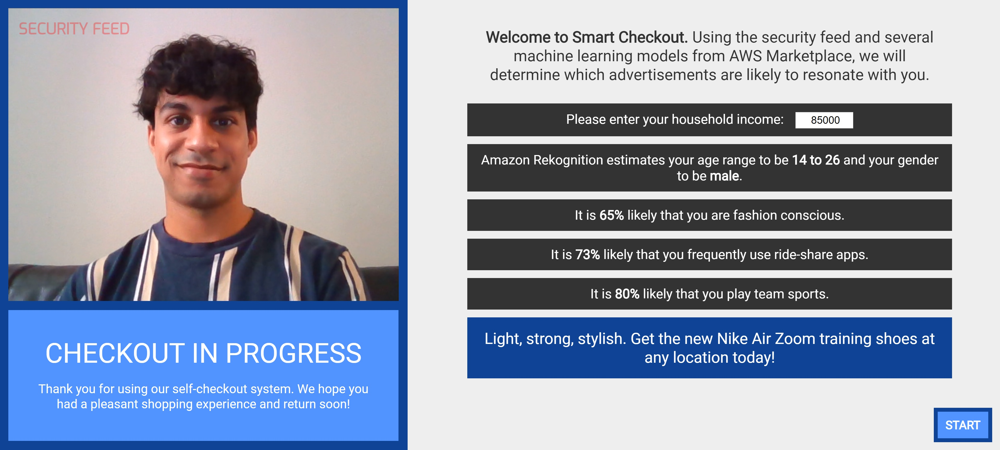
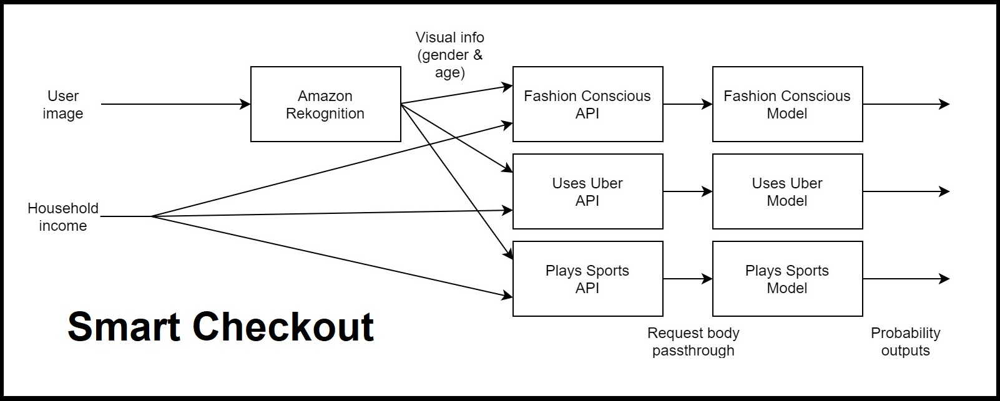

# Smart Checkout
## Nishir Shelat, AWS Marketplace Developer Challenge
Smart Checkout is an ML-powered self-checkout system that helps businesses provide personalized advertisements to customers. It extracts gender and age information from the security camera, feeding them into several propensity models to determine which advertisements would resonate most with each shopper.   

### Deployment Instructions
Follow these instructions if you would like to deploy the application yourself. While this application takes input from your webcam, you can find sample input/output for Amazon Rekognition [here](https://us-west-1.console.aws.amazon.com/rekognition/home?region=us-west-1#/face-detection) (you might need to sign into the console to view the demo). You can also find sample input/output data for the propensity models [here](https://github.com/goprosper/prosper-sagemaker-basic/blob/master/using_prosper_model_package_basic.ipynb).
#### Setting up the propensity models using Amazon SageMaker
This application uses three propensity models from AWS Marketplace: [Fashion Conscious](https://aws.amazon.com/marketplace/pp/prodview-snyxzel75fxms?ref_=ml_hackathon), [Use Uber Regularly](https://aws.amazon.com/marketplace/pp/prodview-ufv6gg5nmcsou?ref_=ml_hackathon), and [Play Team Sports](https://aws.amazon.com/marketplace/pp/prodview-vc3uv4uwxlf6e?ref_=ml_hackathon). After subscribing to them, set up an endpoint for each one. Note that the endpoints accept gender, age, and household income, formatted together as one comma-delimited string. Each returns the probability [0-1] that a given user is interested in fashion, Uber, or team sports, respectively.
#### Exposing the endpoints using Amazon API Gateway
We want to expose the model endpoints so that our web application can easily invoke them. Set up three REST APIs (POST) in the API Gateway console. Set each one to passthrough the request body in a POST request to the corresponding SageMaker endpoint you created earlier. Now you have three APIs, one for each of the propensity models mentioned above. Deploy all three, and put the URLs in js/constants.js, located in the repo.
#### Setting up image analysis with Amazon Rekognition
Go to the Amazon Cognito console and create a new identity pool, enabling access to unauthenticated identities and attaching the AmazonRekognitionReadOnlyAccess policy. Put the identiy pool ID and AWS region in js/constants.js, located in the repo.
### Testing Instructions
Now that the application has been set up, open index.html in a browser to view it. Making sure your face is visible in the security feed, enter a household income value, and click the "START" button to run.
### Architecture Diagram

This is the system flow:
1. The user enters their household income and presses START
2. A snapshot of the user from the security feed is sent to Amazon Rekognition
3. Amazon Rekognition sends back the user's gender and age information
4. The gender, age, and household income values are sent via POST request to Amazon API Gateway
5. Amazon API Gateway passes the data to the Amazon SageMaker models
6. Amazon SageMaker returns the probabilities calculated by each model
7. These values are used to determine which advertisement to display